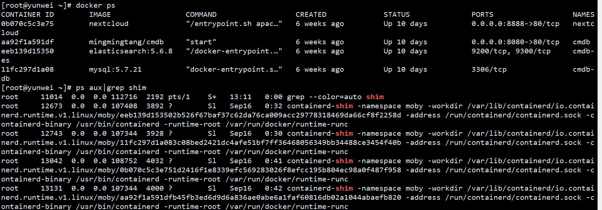
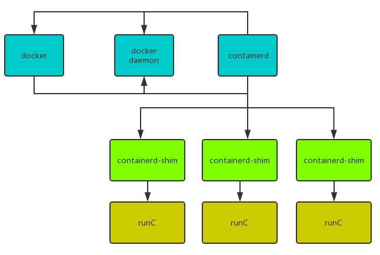

从docker1.11版本开始，docker容器运行已经不是简单的通过docker daemon守护进程来启动，而是集成了containerd、containerd-shim、runC等多个组件。docker服务启动之后，系统上通过命令可以查看到dockerd、docker-containerd等进程。

### Docker容器组件介绍
#### Docker CLI(docker)
docker程序是一个客户端工具，用来把用户的请求发送给docker daemon(dockerd)。

#### Dockerd
dockerd作为docker容器管理的守护进程（docker daemon），守护进程负责和docker client交互，并管理docker镜像和容器；一般也会被称为docker engine。

#### Containerd
containerd是容器技术标准化之后的产物，为了能够兼容OCI标准，将容器运行时及其管理功能从docker daemon剥离。理论上，即使不运行dockerd，也能够直接通过containerd来管理容器。

#### Containerd-shim
它是containerd的组件，是容器的运行时载体，在容器的主机上通过命令可以查看到每个docker容器所对应的containerd-shim。

#### RunC
runC进程是作为containerd-shim的子进程存在的,runC进程根据配置找到容器的rootfs并创建子进程bash作为容器中的第一个进程。当这一切都完成后runC进程退出，然后容器进程bash由runC的父进程containerd-shim接管。

### Docker组件工作流程

docker客户端向dockerd发送请求创建容器，dockerd会从容器镜像仓库拉取镜像。  

dockerd从镜像仓库拉取对应镜像，并向containerd发起运行容器的请求。  

当containerd收到dockerd启动容器的请求之后，会做一些初始化工作，然后启动containerd-shim进程，并将相关配置作为参数传给它。docker-containerd负责管理所有本机正在运行的容器，而一个containerd-shim进程只负责管理一个运行的容器。  

containerd-shim启动runC进程，runC进程把容器输出的内容反馈给containerd-shim，最终传递到docker客户端。

